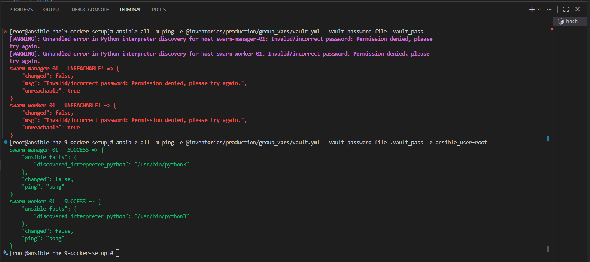
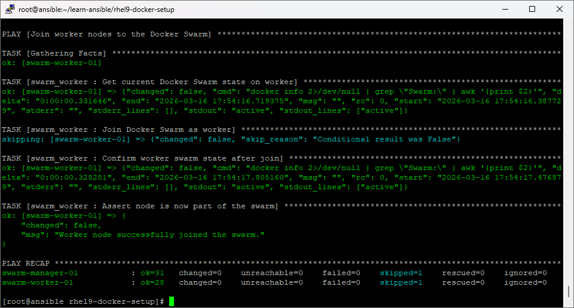

# rhel9-docker-setup

Ansible project that provisions a **fully functional 2-node Docker Swarm** on AlmaLinux 9, intended for local CI/CD pipelines and personal/portfolio projects.

---

## Architecture

```
┌─────────────────────────────────────────────────────────────────┐
│                        Local Network                            │
│                                                                 │
│   ┌──────────────────────────┐   ┌──────────────────────────┐   │
│   │   swarm-manager-01       │   │   swarm-worker-01        │   │
│   │   AlmaLinux 9            │   │   AlmaLinux 9            │   │
│   │   192.168.1.10 (example) │   │   192.168.1.11 (example) │   │
│   │                          │   │                          │   │
│   │   • Docker Swarm Manager │   │   • Docker Swarm Worker  │   │
│   │   • Swarm API :2377      │   │   • Joins via token      │   │
│   └──────────────┬───────────┘   └──────────────┬───────────┘   │
│                  │  Swarm management (2377/tcp)  │              │
│                  │  Node gossip  (7946/tcp+udp)  │              │
│                  │  Overlay VXLAN (4789/udp)     │              │
│                  └───────────────────────────────┘              │
└─────────────────────────────────────────────────────────────────┘
```

### Roles

| Role | Applied To | Responsibility |
|------|-----------|----------------|
| `bootstrap` | all nodes | Creates `ansible` OS user, sets password, adds to `wheel`, drops sudoers file. Runs as `bootstrap_user` (root) |
| `common` | all nodes | Hostname, `/etc/hosts`, base packages, chrony/NTP, firewalld rules |
| `docker` | all nodes | Docker CE repository, packages, daemon config, service management |
| `swarm_manager` | `swarm_managers` | `docker swarm init`, exposes join tokens as Ansible facts |
| `swarm_worker` | `swarm_workers` | `docker swarm join` using token from manager |

### Playbook execution order

```
site.yml
  ├── play 0: bootstrap     → hosts: swarm        (runs as bootstrap_user / root)
  ├── play 1: common        → hosts: swarm
  ├── play 2: docker        → hosts: swarm
  ├── play 3: swarm_manager → hosts: swarm_managers
  └── play 4: swarm_worker  → hosts: swarm_workers
```

---

## Directory Structure

```
rhel9-docker-setup/
├── ansible.cfg
├── site.yml
├── requirements.yml
├── .gitignore
├── inventories/
│   └── production/
│       ├── hosts.ini                         # INI-format inventory
│       ├── group_vars/
│       │   ├── all.yml                       # Non-sensitive global variables
│       │   ├── vault.yml                     # Vault-encrypted secrets (load with -e @)
│       │   ├── swarm_managers.yml            # Manager group variables
│       │   └── swarm_workers.yml             # Worker group variables
│       └── host_vars/
│           ├── swarm-manager-01.yml          # IP, hostname, advertise addr
│           └── swarm-worker-01.yml           # IP, hostname
└── roles/
    ├── bootstrap/
    │   ├── defaults/main.yml       # bootstrap_user, ansible_sudo_spec
    │   └── tasks/main.yml
    ├── common/
    │   ├── defaults/main.yml       # common_packages, swarm_firewall_ports
    │   ├── tasks/main.yml
    │   ├── handlers/main.yml
    │   └── templates/hosts.j2
    ├── docker/
    │   ├── defaults/main.yml       # docker_packages, docker_daemon_config
    │   ├── tasks/main.yml
    │   ├── handlers/main.yml
    │   └── templates/daemon.json.j2
    ├── swarm_manager/
    │   ├── defaults/main.yml
    │   └── tasks/main.yml
    └── swarm_worker/
        ├── defaults/main.yml
        └── tasks/main.yml
```

---

## Prerequisites

### Control node (where you run Ansible)

- Ansible ≥ 2.14 (install via `ansible-rhel-setup.sh` in the repository root)
- Python ≥ 3.9

### Managed nodes (swarm-manager-01, swarm-worker-01)

- AlmaLinux 9 (fresh install)
- Root (or initial admin) SSH access with a known password — used only for the **bootstrap** play to create the `ansible` user
- After bootstrap runs, all subsequent plays connect as the `ansible` user

---

## Quick Start

### 1. Install required Ansible collections

```bash
cd rhel9-docker-setup
ansible-galaxy collection install -r requirements.yml
```

### 2. Update inventory host IPs

Edit the files to reflect your real node IP addresses:

```
inventories/production/host_vars/swarm-manager-01.yml
inventories/production/host_vars/swarm-worker-01.yml
```

### 3. Set up vault credentials

The vault file holds three passwords:

| Key | Purpose |
|-----|---------|
| `vault_bootstrap_password` | Password of the initial root/admin user on each node |
| `vault_ansible_password` | Password set for the new `ansible` OS user |
| `vault_become_password` | Sudo password used by Ansible (same as `vault_ansible_password`) |

Edit the vault file:

```bash
ansible-vault edit inventories/production/group_vars/vault.yml
```

If this is the first time, the file contains a placeholder. Encrypt it:

```bash
ansible-vault encrypt inventories/production/group_vars/vault.yml
```

Store the vault password in a local file (never commit it):

```bash
echo "your-vault-password" > .vault_pass
chmod 600 .vault_pass
```

The `.vault_pass` file is listed in `.gitignore`.

### 4. Verify connectivity

```bash
ansible all -m ping \
  -e @inventories/production/group_vars/vault.yml \
  --vault-password-file .vault_pass
```
Note: If the `ansible` user isn't configured in the remote servers yet, set the user as `root` first by appending `-e ansible_user=root` in the `ansible-playbook` command.



### 5. Run the playbook

Use the `run-playbook.sh` wrapper so every execution is automatically logged:

```bash
../run-playbook.sh site.yml \
  -e @inventories/production/group_vars/vault.yml \
  --vault-password-file .vault_pass
```

Run with verbose output for troubleshooting:

```bash
../run-playbook.sh site.yml \
  -e @inventories/production/group_vars/vault.yml \
  --vault-password-file .vault_pass -v
```

Logs are written to `./logs/` with the format:

```
logs/YYYY-MM-DD_HH-MM-SS_<playbook>.log
```

The `logs/` directory is listed in `.gitignore`.

---

## Logging

`run-playbook.sh` is a thin wrapper around `ansible-playbook` that:

- Creates `./logs/` automatically on first run.
- Names each log file `YYYYMMDD_HHMMSS_<playbook>.log` so runs never overwrite each other.
- Streams output to the terminal **and** the log file simultaneously via `tee`.
- Writes a structured header (timestamp, user, hostname, full command) and footer (result, exit code) around the Ansible output in the log.
- Returns the original `ansible-playbook` exit code so CI/CD tools see success or failure correctly.

```
logs/
└── 20260316_103000_site.log
└── 20260316_114512_site.log
```

The wrapper accepts all standard `ansible-playbook` flags and passes them through unchanged.

```bash
# Target a single host
../run-playbook.sh site.yml --limit swarm-worker-01 \
  -e @inventories/production/group_vars/vault.yml \
  --vault-password-file .vault_pass

# Run only tagged tasks
../run-playbook.sh site.yml --tags docker \
  -e @inventories/production/group_vars/vault.yml \
  --vault-password-file .vault_pass
```

---

## Variable Reference

### `group_vars/all.yml`

| Variable | Default | Description |
|----------|---------|-------------|
| `ansible_user` | `ansible` | SSH user for all plays after bootstrap |
| `ansible_become` | `true` | Enable privilege escalation |
| `ansible_become_method` | `sudo` | Escalation method |
| `ansible_become_password` | `{{ vault_become_password }}` | Sudo password (from vault) |
| `bootstrap_user` | `root` | Initial OS user used by the bootstrap play |
| `swarm_port` | `2377` | Docker Swarm management port |
| `docker_packages` | see file | Docker CE package list |

### `group_vars/vault.yml` (encrypted)

| Variable | Description |
|----------|-------------|
| `vault_bootstrap_password` | Password of the initial root/admin user (used once, during bootstrap) |
| `vault_ansible_password` | Password to set for the new `ansible` OS user |
| `vault_become_password` | Sudo password for `ansible_user` (typically same as `vault_ansible_password`) |

### `host_vars/swarm-manager-01.yml`

| Variable | Description |
|----------|-------------|
| `ansible_host` | IP address of the manager node |
| `swarm_node_hostname` | Hostname set on the OS |
| `swarm_advertise_addr` | IP used to advertise the Swarm API |

### `host_vars/swarm-worker-01.yml`

| Variable | Description |
|----------|-------------|
| `ansible_host` | IP address of the worker node |
| `swarm_node_hostname` | Hostname set on the OS |

### Role defaults – `roles/bootstrap/defaults/main.yml`

| Variable | Description |
|----------|-------------|
| `bootstrap_user` | OS user for the initial connection (default: `root`) |
| `ansible_os_user` | Name of the user to create (mirrors `ansible_user`) |
| `ansible_os_user_shell` | Login shell for the ansible user (default: `/bin/bash`) |
| `ansible_sudoers_file` | Path to the sudoers drop-in file (default: `/etc/sudoers.d/ansible`) |
| `ansible_sudo_spec` | Sudo rule written into the drop-in (default: `ALL=(ALL) ALL`) |

### Role defaults – `roles/common/defaults/main.yml`

| Variable | Description |
|----------|-------------|
| `common_packages` | Base packages installed on all nodes |
| `common_timezone` | System timezone (default: `UTC`) |
| `swarm_firewall_ports` | Ports opened in firewalld for Swarm traffic |

### Role defaults – `roles/docker/defaults/main.yml`

| Variable | Description |
|----------|-------------|
| `docker_packages` | Docker CE packages to install |
| `docker_daemon_config` | Dict rendered to `/etc/docker/daemon.json` |

---

## Firewall Rules Applied

The `common` role opens the following ports on all swarm nodes:

| Port | Protocol | Purpose |
|------|----------|---------|
| 2377 | TCP | Docker Swarm cluster management |
| 7946 | TCP | Swarm node-to-node communication |
| 7946 | UDP | Swarm node-to-node communication |
| 4789 | UDP | Overlay network traffic (VXLAN) |

---

## Security Notes

- **Vault**: All secrets live exclusively in the `vault.yml` file which must be encrypted before committing. Never hard-code passwords or tokens in playbooks or variable files.
- **SSH**: Key-based authentication is strongly recommended. Avoid `ansible_ssh_pass` in an SSH password.
- **Sudo**: The `ansible` user should have targeted sudo rules (not a blanket `NOPASSWD:ALL`) in a production environment.
- **SELinux**: AlmaLinux 9 ships with SELinux enforcing. Docker CE is compatible with SELinux enforcing on RHEL 9. No changes are made to the SELinux state by this playbook.
- **Vault password file** (`.vault_pass`) is listed in `.gitignore` to prevent accidental commits.

---

## Idempotency

Every task is designed to be safely re-run:

- Package installation uses `state: present` (skipped if already installed).
- `docker swarm init` is guarded by a check for `Swarm: active` in `docker info` output.
- `docker swarm join` is likewise guarded and skipped if already in the swarm.
- Firewall rules use `permanent: true` and `immediate: true` together.



---

## Extending the Setup

| Goal | Approach |
|------|---------|
| Add more worker nodes | Add hosts under `[swarm_workers]` in `hosts.ini` and create a matching `host_vars/<hostname>.yml` file |
| Pin Docker CE version | Override `docker_packages` in `group_vars/all.yml` with versioned package names |
| Deploy a registry | Add a new `registry` role and play after the swarm plays |
| Deploy Portainer | Add a `portainer` role that runs `docker stack deploy` on the manager |
| Add an overlay network | Extend `swarm_manager` tasks with `docker network create --driver overlay` |
| Use SSH keys instead of vault | Remove `ansible_become_password` / vault and rely on `NOPASSWD` sudo rules |
